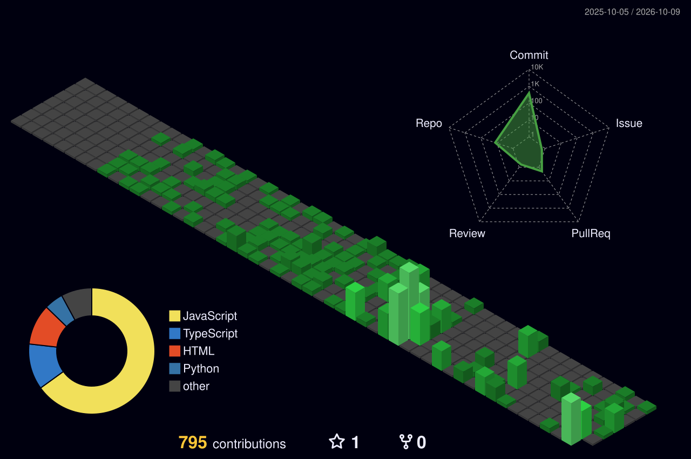
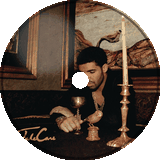
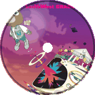

<!-- HEADER -->

---

### `> ls ./projects`

| Project | What it does | Stack | Link |
|---------|-------------|-------|------|
| **16-0 IPL Sim** | Fantasy IPL draft-and-sim game — spin for real franchise-seasons, build a role-locked XI, and simulate a full league + playoffs against 808 rated players across 3,353 player-seasons | React · Supabase · Vercel | [play →](https://16-0game.vercel.app) · [repo →](https://github.com/Sharone-12/16-0-IPL-Sim) |
| **Mulenet** | A fraud-detection engine that finds money-mule rings in transaction data by combining five independent graph detectors into a ranked investigator queue | Python · pandas · FastAPI · graph algorithms | [repo →](https://github.com/Sharone-12/mulenet) |
| **F1 Race Sim** | A browser race-strategy simulator — set tyres, fuel, and pit calls, then watch a physics-driven lap-by-lap race play out against an AI grid | FastAPI · FastF1 · React/Vite | [play →](https://f1racesim.vercel.app) · [repo →](https://github.com/Sharone-12/F1-Sim) |
| **Pilgrimage** | A browser combat game where you defeat mythological bosses by crafting prompts instead of button-mashing | FastAPI · Groq · Vanilla JS | [play →](https://pilgrimage-steel.vercel.app) · [repo →](https://github.com/Sharone-12/pilgrimage) |

 

### `> cat ./stack.yml`

 

### `> render ./contrib-3d`

<!-- 3D Contribution Graph — generated by GitHub Action, see .github/workflows/profile-3d-contrib.yml -->

 

### `> git stats`

 

 

### `> play ./now-spinning.mp3`

 

### `> watch ./snake`

<!-- Contribution Snake — generated by GitHub Action, see .github/workflows/snake.yml -->

 

---

